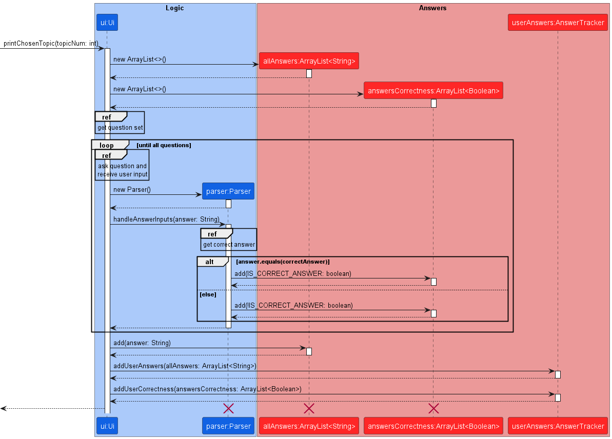
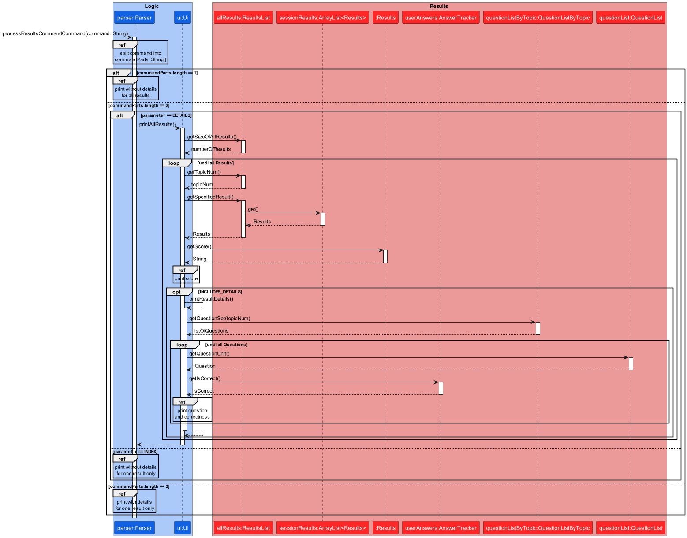
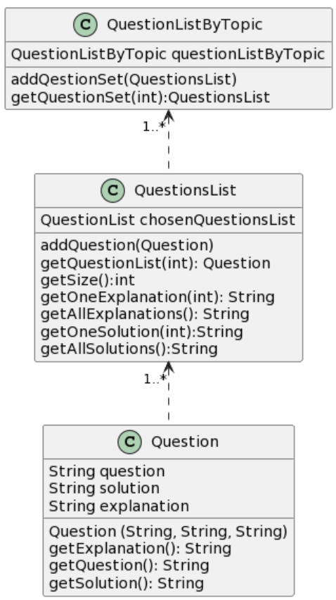

# Developer Guide

## Design & implementation

{Describe the design and implementation of the product. Use UML diagrams and short code snippets where applicable.}

### Results feature

The results feature is facilitated by `ResultsList` and 
`AnswerTracker`. Both are used to display the results for
all question sets attempted by the user, including details
such as specific questions and their respective answer inputs
from the user.

Given below is an example usage scenario and how the results
mechanism behaves at each step.

Step 1. The user launches the application for the first time,
and proceeds to start a game with their chosen topic.

The following sequence diagram shows how the `Results` for
one question set is added to the `ResultsList`:  

> **Note:** The lifeline for Parser and Results should end
> at the destroy marker (X) but due to a limitation of PlantUML,
> the lifeline reaches the end of the diagram.

Similarly, the following sequence diagram shows how the
`AnswerTracker` stores all the user answer inputs:  

> **Note:** The lifeline for Parser, allAnswers, and answersCorrectness
> should end
> at the destroy marker (X) but due to a limitation of PlantUML,
> the lifeline reaches the end of the diagram.

Step 2. The user may repeat Step 1 with other question sets.  

The sequence diagram for this step involving `ResultsList` 
and `AnswerTracker` are the same as the ones shown in Step 1.

Step 3. The user now wants to view their results by executing
the `results` command.  

> **Note:** If the user uses the results feature before
> attempting any questions, the application will instead 
> return an error to the user indicating that there are no 
> results.

### Topics Feature

The topics feature comprises `TopicList` and `QuestionListByTopic`. 
`TopicList` is the list of topics for the users to attempt.
`QuestionListByTopic` stores the respective question set for each topic in an ArrayList. 

Given below is an example usage scenario and how the results
mechanism behaves at each step.

Step 1. The user launches the application for the first time,
and proceeds to start a game with their chosen topic.

The following shows the class diagram for `topicList`:

Step 2. A question from the question set of the chosen topic is displayed.
        The user inputs their answer.

Step 3. Step 2 repeats until all the questions in the question set has been asked.
        Step 1 executes and process repeats.

The following shows the class diagram for `QuestionListByTopic`:

### Solution feature

The solution feature either prints the solution to 1 question or all questions in 1 topic.

The solution feature is facilitated by `Parser#processSolutionCommand`, which is called by `Parser#parseCommand`

> **OVERVIEW:**
> 

> > **Note:** The lifeline for Parser and Results should end
> at the destroy marker (X) but due to a limitation of PlantUML,
> the lifeline reaches the end of the diagram.

Step 1: After user runs the program and keys in the user command, the command will be passed to 
`Parser#parseCommand`. 

> **NOTE:** The command must contain the `solution` keyword.

Step 2a: `Parser#processSolutionCommand` first checks the number of parameters in the user command 
by calling `Parser#checkIfTwoParameters`.
The, further processing of parameters is done by calling `Parser#getTopicOrQuestionNum`. 
This is facilitated by calling `QuestionsListByTopic#getQuestionSet` to get all questions in the specified topic.

Step 2b: Before getting the solution(s), the program first verifies if the topic has been attempted before.
The program only prints them only if the topic is attempted before.
The topic is selected by calling `TopicList#get` and `TopicList#hasAttempted` returns the attempted status.

Step 3:
Depending on the number of parameters,
if there is 1 parameter (ie get all solutions):
`QuestionsList#getAllSolutions` will get all solutions and `ui#printAllSolutions` will print them.
else if there are 2 parameters (ie get one solution):
`QuestionsList#getOneSolution` will get the specified solution and `ui#printOneSolution` will print it.

### Explain feature
The explain feature either prints the explanation to 1 question or all questions in 1 topic.

The explain feature is facilitated by `Parser#processExplanationCommand`, which is called by `Parser#parseCommand`

Step 1: After user runs the program and keys in the user command, the command will be passed to
`Parser#parseCommand`.

> **NOTE:** The command must contain the `explain` keyword.
> 
> Sequence diagram for `explain` is similar to the [sequence diagram](#solution-feature) for `solution` feature

Step 2a: `Parser#processExplainCommand` first checks the number of parameters in the user command
by calling `Parser#checkIfTwoParameters`.
The, further processing of parameters is done by calling `Parser#getTopicOrQuestionNum`.
This is facilitated by calling `QuestionsListByTopic#getQuestionSet` to get all questions in the specified topic.

Step 2b: Before getting the explanation(s), the program first verifies if the topic has been attempted before.
The program only prints them only if the topic is attempted before.
The topic is selected by calling `TopicList#get` and `TopicList#hasAttempted` returns the attempted status.

Step 3:
Depending on the number of parameters,
if there is 1 parameter (ie get all explanations):
`QuestionsList#getAllExplanations` will get all explanations and `ui#printAllExplanations` will print them.
else if there are 2 parameters (ie get one explanation):
`QuestionsList#getOneExplanation` will get the specified explanation and `ui#printOneExplanation` will print it.

## Product scope

### Target user profile

CS2113/2103 students who wish to have an efficient tool to help them revise relevant concepts.

### Value proposition

Integration of key notions and learning objectives for CS2113 course, self-adaptive testing for understanding and feedback.

## User Stories

| Version | As a ...                       | I want to ...                                        | So that I can ...                                                      |
|---------|--------------------------------|------------------------------------------------------|------------------------------------------------------------------------|
| v1.0    | new user                       | see user guide in the app                            | refer to them if I am unfamiliar with the usage of a command           |
| v1.0    | student new to Java            | receive solutions with explanation after answering   | be aware of the reasoning behind the correct answer                    | 
| v2.0    | regular user                   | see a progress bar when answering MCQs               | track my progress when attempting a question set                       |
| v2.0    | regular user                   | see a progress bar about all topics in the main menu | track my revision progress for the entire course                       |
| v2.0    | student going to take the exam | access timed modes in the game easily                | train my thought process to quicken in preparation for tests           |
| v2.0    | student new to Java            | avoid memorization of specific question sets through randomly generated practice sets  | I can ensure I understand the concepts rather than memorising answers  |

## Non-Functional Requirements

Usability: the user is able to use the app without reading lengthy documentations.

Technical: the app should run on both macOS and Windows

## Glossary

- _glossary item_ - Definition

## Acknowledgements

### Libraries

1. Display formatted tables in the CLI - [ASCII TABLES](https://bethecoder.com/applications/products/asciiTable.action)

2. Topic selection menu and testing mode progress bar - [ProgressBar](https://github.com/ctongfei/progressbar)

### References

## Instructions for manual testing

{Give instructions on how to do a manual product testing e.g., how to load sample data to be used for testing}
