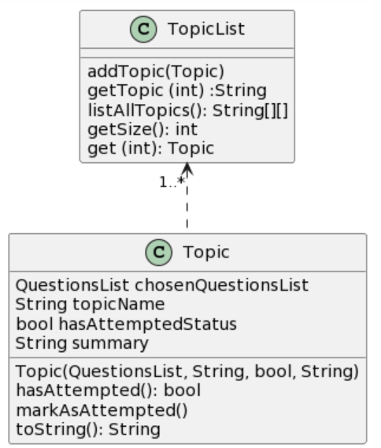

# Developer Guide

* [Implementation](#implementation)
  * [Results Feature](#results-feature)
  * [Topic Feature](#topics-feature)
  * [Solution Feature](#solution-feature) 
  * [Explain Feature](#explain-feature)
* [Appendix: Requirements](#appendix-requirements)
    * [Product Scope](#product-scope)
    * [User Stories](#user-stories)
    * [Non-Functional Requirements](#non-functional-requirements)
    * [Glossary](#glossary)
    * [Acknowledgements](#acknowledgements)
* [Appendix: Instructions for manual testing](#appendix-instructions-for-manual-testing)
    * Launch and Shutdown (TODO: include testing methods)
    * (include tests for other features)

## Implementation

### Results Feature

The results feature is facilitated by `ResultsList` and
`AnswerTracker`. Both are used to display the results for
all question sets attempted by the user, including details
such as specific questions and their respective answer inputs
from the user.

Given below is an example usage scenario and how the results
mechanism behaves at each step.

Step 1. The user launches the application for the first time,
and proceeds to start a game with their chosen topic.

The following sequence diagram shows how the `Results` for
one question set is added to the `ResultsList`:  

> **Note:** The lifeline for Parser and Results should end
> at the destroy marker (X) but due to a limitation of PlantUML,
> the lifeline reaches the end of the diagram.

Similarly, the following sequence diagram shows how the
`AnswerTracker` stores all the user answer inputs:  

> **Note:** The lifeline for Parser, allAnswers, and answersCorrectness
> should end
> at the destroy marker (X) but due to a limitation of PlantUML,
> the lifeline reaches the end of the diagram.

Step 2. The user may repeat Step 1 with other question sets.

The sequence diagram for this step involving `ResultsList`
and `AnswerTracker` are the same as the ones shown in Step 1.

Step 3. The user now wants to view their results by executing
the `results` command.  

> **Note:** If the user uses the results feature before
> attempting any questions, the application will instead
> return an error to the user indicating that there are no
> results.

### Topics Feature

The topics feature comprises `TopicList` and `QuestionListByTopic`.
`TopicList` is the list of topics for the users to attempt.
`QuestionListByTopic` stores the respective question set for each topic in an ArrayList.

Given below is an example usage scenario and how the results
mechanism behaves at each step.

Step 1. The user launches the application for the first time,
and proceeds to start a game with their chosen topic.

The following shows the class diagram for `topicList`:

Step 2. A question from the question set of the chosen topic is displayed.
The user inputs their answer.

Step 3. Step 2 repeats until all the questions in the question set has been asked.
Step 1 executes and process repeats.

The following shows the class diagram for `QuestionListByTopic`:

### Solution Feature

The solution feature either prints the solution to 1 question or all questions in 1 topic.

The solution feature is facilitated by `Parser#processSolutionCommand`, which is called by `Parser#parseCommand`

> **OVERVIEW:**
> 

> > **Note:** The lifeline for Parser and Results should end
> at the destroy marker (X) but due to a limitation of PlantUML,
> the lifeline reaches the end of the diagram.

Step 1: After user runs the program and keys in the user command, the command will be passed to
`Parser#parseCommand`.

> **NOTE:** The command must contain the `solution` keyword.

Step 2a: `Parser#processSolutionCommand` first checks the number of parameters in the user command
by calling `Parser#checkIfTwoParameters`.
The, further processing of parameters is done by calling `Parser#getTopicOrQuestionNum`.
This is facilitated by calling `QuestionsListByTopic#getQuestionSet` to get all questions in the specified topic.

Step 2b: Before getting the solution(s), the program first verifies if the topic has been attempted before.
The program only prints them only if the topic is attempted before.
The topic is selected by calling `TopicList#get` and `TopicList#hasAttempted` returns the attempted status.

Step 3:
Depending on the number of parameters,
if there is 1 parameter (ie get all solutions):
`QuestionsList#getAllSolutions` will get all solutions and `ui#printAllSolutions` will print them.
else if there are 2 parameters (ie get one solution):
`QuestionsList#getOneSolution` will get the specified solution and `ui#printOneSolution` will print it.

### Explain Feature

The explain feature either prints the explanation to 1 question or all questions in 1 topic.

The explain feature is facilitated by `Parser#processExplanationCommand`, which is called by `Parser#parseCommand`

Step 1: After user runs the program and keys in the user command, the command will be passed to
`Parser#parseCommand`.

> **NOTE:** The command must contain the `explain` keyword.
>
> Sequence diagram for `explain` is similar to the [sequence diagram](#solution-feature) for `solution` feature

Step 2a: `Parser#processExplainCommand` first checks the number of parameters in the user command
by calling `Parser#checkIfTwoParameters`.
The, further processing of parameters is done by calling `Parser#getTopicOrQuestionNum`.
This is facilitated by calling `QuestionsListByTopic#getQuestionSet` to get all questions in the specified topic.

Step 2b: Before getting the explanation(s), the program first verifies if the topic has been attempted before.
The program only prints them only if the topic is attempted before.
The topic is selected by calling `TopicList#get` and `TopicList#hasAttempted` returns the attempted status.

Step 3:
Depending on the number of parameters,
if there is 1 parameter (ie get all explanations):
`QuestionsList#getAllExplanations` will get all explanations and `ui#printAllExplanations` will print them.
else if there are 2 parameters (ie get one explanation):
`QuestionsList#getOneExplanation` will get the specified explanation and `ui#printOneExplanation` will print it.

## Appendix: Requirements

### Product scope

**Target user profile:**
* revising Java OOP and Software Engineering concepts taught in CS2113/T 
* prefer desktop app over other types
* can type fast
* reasonably comfortable with CLI

**Value proposition:** more accessible than current CS2113/T website as questions are consolidated in dataset. In addition, able to keep track of progress.  

### User Stories

Priorities: High (must-have) - `***`, Medium (good-to-have) - `**`, Low (nice-to-have) - `*`

| Version | Priority | As a ...            | I want to ...                                        | So that I can ...                                          |
|---------|----------|---------------------|------------------------------------------------------|------------------------------------------------------------|
| v1.0    | ***      | new user            | access the tutorial / guide to the game easily       | refer to it if I am unfamiliar with the usage of a command |
| v1.0    | ***      | new user            | choose a topic                                       | choose a specific topic to revise on                       |
| v1.0    | **       | regular user        | take note of the questions answered wrong previously | revisit past mistakes and learn from them                  |
| v1.0    | ***      | student new to Java | receive solutions after answering                    | learn the correct solution for the question                |
| v1.0    | **       | student new to Java | receive explanations after answering                 | learn the correct explanation for the solution             |
| v1.0    | **       | regular user        | clear my progress in the game                        | start anew                                                 |
| v1.0    | ***      | busy user           | exit the game                                        | I can do other things in life                              |
| v2.0    | **       | regular user        | see a progress bar when answering MCQs               | track my progress when attempting a question set           |
| v2.0    | **       | regular user        | see a progress bar about all topics in the main menu | track my revision progress for the entire course           |
| v2.0    | **       | regular user        | access timed modes in the game easily                | train my answering speed in preparation for tests          |
| v2.0    | **       | student new to Java | practice on a random topic                           | avoid memorizing answers if I do a topic repeatedly        |
| v2.0    | **       | regular user        | come back to my saved points in the game             | continue working from my previous progress                 |
| v2.0    | **       | busy user           | study in smaller chunks by having checkpoints        | play the game during my small slots of free time           |
| TBC     | *        | regular user        | have topics' suggestion instead of choosing one      | I can avoid choosing a topic and be lazy                   |
| TBC     | *        | busy user           | have a reminder to do questions                      | I can keep track with the lectures                         |

*[More to be added]*

## Non-Functional Requirements

1. Should work on any *mainstream* OS as long as it has Java `11` or above installed
2. A user with average typing speed should be able to find and answer questions faster than using the CS2113/T course website

## Glossary

- *mainstream OS:* Windows, Linux, MacOS

## Acknowledgements

*Libraries:*

1. Display formatted tables in the CLI - [ASCII TABLES](https://bethecoder.com/applications/products/asciiTable.action)

2. Topic selection menu and testing mode progress bar - [ProgressBar](https://github.com/ctongfei/progressbar)

### Appendix: Instructions for Manual Testing
> **NOTE:**
> These instructions only provide a starting point for testers to work on.
> They are non-exhaustive and testers are encouraged to do more _exploratory_ testing.

{Give instructions on how to do a manual product testing e.g., how to load sample data to be used for testing}
