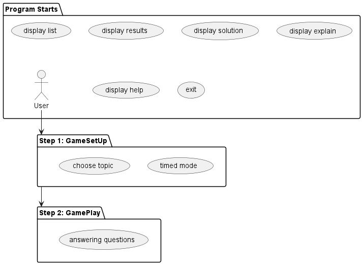

# [Player2113](https://github.com/AY2324S2-CS2113-F15-1/tp/releases)

Player2113 is a **desktop app for helping CS2113/T students revise Java OOP concepts in a gamification environment via a
Command Line Interface** (CLI).

* [Getting Started](#getting-started)
* [Usage](#usage)
* [Features](#features)
  * [Choosing a topic: `topic`](#1-starting-game-topic)
  * [Displaying results: `results`](#2-viewing-results-results)
  * [Displaying solution: `solution`](#3-get-solutions-for-a-question--topic-solution)
  * [Displaying explanations: `explain`](#4-get-explanations-for-a-question--topic-explain)
  * [Entering timed mode: `timed mode`](#5-attempt-the-questions-under-a-time-limit-timed-mode)
  * [List All Topics: `list`](#6-list-all-available-topics-and-their-summaries-list)
  * [View help: `help`](#7-viewing-help-help)
  * [Pause the game: `pause`](#8-pausing-the-game-pause)
  * [Resume the game: `resume`](#9-resuming-the-game-resume)
  * [Customise questions: `custom`](#10-customise-questions-custom)
  * [Checkpoint goals: `checkpoint`](#11-checkpoint-goals-checkpoint)
  * [Clear progress: `clear`](#12-clear-progress-clear)
  * [Exit the program: `bye`](#13-exiting-the-game-bye)
* [FAQ](#faq)
* [Command Summary](#command-summary-of-features)


## Getting Started

Prerequisites: JDK 11, Player2113 release `JDK` file. Please ensure the terminal screen size is at least `80(w)*18(h)` characters for optimal experience.

Start the programme with the following command:

```
java -jar Player2113.jar
```

You will see the welcome screen upon successful start-up:

```
Hello from
______ _                       _____  __   __   _____
| ___ \ |                     / __  \/  | /  | |____ |
| |_/ / | __ _ _   _  ___ _ __`' / /'`| | `| |     / /
|  __/| |/ _` | | | |/ _ \ '__| / /   | |  | |     \ \
| |   | | (_| | |_| |  __/ |  ./ /____| |__| |_.___/ /
\_|   |_|\__,_|\__, |\___|_|  \_____/\___/\___/\____/
                __/ |
               |___/
What is your name?
```

## Usage

> **IMPORTANT**
> 
> The current release of Player2113 is a MVP preview version with various proposed functions unimplemented. Please
> strictly follow this user's guide.
> For optimal viewing, please run Player2113 on a full-screen sized terminal window.

> **NOTE** [coming in v3.0]
> 
> More topics will be released in v3.0

GameFlow sequence is as shown:



## Features

> **NOTE:**
> + Words in UPPER_CASE are to be supplied by the user e.g. in `results [details] [INDEX]`, `INDEX` is open to user
    input, such as `1` or `2`.
> + Words in lower_case are fixed e.g. in `results [details] [INDEX]`, `details` has to be input by the user exactly for
    that parameter.
> + Items in square brackets are optional
    e.g. in `solution TOPIC_NUM [INDEX]`, `TOPIC_NUM` is a compulsory parameter like `solution 1 1`,
  while `INDEX` is an optional parameter like `solution 1`

### 1. Starting game: `topic`

There are multiple question banks pre-configured in Player2113 for each topic.
Start the game by selecting a topic from the menu.
After choosing a topic, questions will start appearing.

Format: `topic TOPIC_INDEX`

- Gameplay will include questions from the specified topic.
- After start, the system will display a question, and the user will have to key in a response.
- Press Enter to submit the response. System will then key in the next question.
- Each question bank has 10 questions.

Sample Output:

```angular2html
What language does CS2113 use?
a. Java
b. C++
c. C
d. Python

Enter your answer: [answer]
*****************************************
[*---------] 10% 1/10 questions attempted
*****************************************
```

### 2. Viewing results: `results`

You may check your answer accuracy after attempting a question set.

Format: `results [details] [ATTEMPT_NUM]`

- Shows scores from the specified ATTEMPT_NUM. It must be a non-zero positive integer (e.g. 1, 2, 3, …) and that attempt
  must exist.
- If `[INDEX]` is omitted, all results will be listed in chronological order of the attempts.
- Adding `[details]` will allow you to view the questions and your answers to those questions. Omitting it will result
  in showing only the score.
- The score is dependent on the number of questions attempted, as opposed to the total number of questions available in
  the topic.
- Anything after `[INDEX]` will be ignored.
- Command works as long as the user input starts with `results` (e.g. `resultsss`, `resultsad`) for easier usage.

Examples: 
`results details 2` shows the results for Attempt 2 (with questions and answers)
`results 2` shows the results for Attempt 2 (score only)


### 3. Get solution(s) for a question / topic: `solution`

Shows solution(s) for a specific question or all questions of a topic
Only possible after attempting topic/ question

Format: `solution TOPIC_NUM [INDEX]`

- The `INDEX` must be a non-zero positive integer (e.g. 1, 2, 3, …).
- If `INDEX` is omitted, command will show all solutions for specified TOPIC_NUM

Examples:
` solution 1` shows the solutions for topic 1
` solution 1 1` shows the solution for topic 1 question 1
` solution  ` will be ignored

### 4. Get explanation(s) for a question / topic: `explain`

Shows explanation(s) for a specific question or all questions of a topic
Only possible after attempting topic/ question

Format: `explain TOPIC_NUM [INDEX]`

- The `INDEX` must be a non-zero positive integer (e.g. 1, 2, 3, …).
- If `INDEX` is omitted, command will show all explanations for specified TOPIC_NUM

Examples:
` explain 1` shows all explanations for topic 1
` explain 1 1` shows the explanation for topic 1 question 1
` explain  ` will be ignored

### 5. Attempt the questions under a time limit: `timed mode`

Pause will not be allowed in timed mode as it is meant to simulate exam conditions.
Timed mode selection happens before topic selection.

Format: `timed mode [TIME_LIMIT]`

- `TIME_LIMIT` represents the time limit set for the question set in seconds
- The`TIME_LIMIT` must be a non-zero positive integer (e.g. 1, 2, 3, …).

Examples:
` timed mode 5` sets time limit to 5s

Sample Output:

```angular2html
Timed mode selected. Please enter the topic you would like to try.
You cannot pause in timed mode!
Input a command player!
```

### 6. List all available topics and their summaries: `list`

A progress bar indicating the overall revision progress will be displayed, followed by a table of question bank summaries.

Format: `list`

Sample Output:

```
[***-------] 30% 1/3 topics attempted
+-------+----------------------------------+----------------------+-----------+
| index |               topic              |        summary       | attempted |
+-------+----------------------------------+----------------------+-----------+
|     1 |  Software Engineering Concepts I |    SE & OOP concepts |      true |
|     2 | Software Engineering Concepts II | SE & OOP concepts II |     false |
|     3 |                   All About Java | General info on Java |     false |
+-------+----------------------------------+----------------------+-----------+
```

### 7. Viewing help: `help`

Displays commands for the application (start game, choose topic, revise, clear/reset progress).
Shows developer credits information.

Format: `help`

Sample Output:


### 8. Pausing the game: `pause`

Pauses the game so that the user may choose to exit the game in the middle of answering the questions.

Format: `pause`

- This command is valid only when the user is answering the topic questions.
- <strong>User cannot pause when in timed mode.</strong>

Sample Output: 

```
Enter your answer: pause
Current progress: The game is paused.
Input "resume" to continue, or "bye" to exit.
Enter your answer:
```

### 9. Resuming the game: `resume`

Resumes the game when the game is paused.

Format: `resume`

- This command is valid only when the game is paused.

### 10. Customise questions: `custom`

This command allows the player to customise the questions by selecting which topic and the number of questions they would like to practise.

Format: `custom TOPIC_NUM NUM_OF_QUESTIONS`

- Upon entering this command, the user will get a customised question set.
- `TOPIC_NUM` and `NUM_OF_QUESTIONS` should be a non-zero positive integer (e.g. 1, 2, 3, ...) that is within range of topics and questions available.

Example: `custom 1 3` will generate a question set of 3 questions from topic 1.

### 11. Checkpoint goals: `checkpoint`

This command allows the user to set a number of questions that they would like to complete in the current session.

Format: `checkpoint NUM_OF_QUESTIONS`

- Upon entering this command, the user will set a checkpoint goal.
- The user can use this checkpoint goal to track number of customised questions attempted.
- `NUM_OF_QUESTIONS` should be a non-zero positive integer (e.g. 1, 2, 3, ...) that is within range of questions available.

Example: `checkpoint 5` will set a goal of 5 questions and the user will get a congratulatory message after reaching this goal by attempting customised questions.

### 12. Clear progress: `clear`

This command allows the user to clear their progress on Player2113.

Format: `clear`

- Upon entering this command, the user will get a prompt to confirm that they want to clear their progress. Upon confirmation, the progress for the user will be cleared.

### 13. Exiting the game: `bye`

All results will be saved to a local save file, which will be loaded up when the application is opened next time.

Format: `bye`

- If exited after pausing the game, you can choose whether to continue from where you left off or
  discard the results for that topic.


A goodbye message will be displayed:

```
bye bye, get more sleep zzz
************************************************
```

## FAQ

**Q**: Who is this product for?

**A**: For those wanting to learn more about CS2113/ Java OOP concepts!

## Command Summary of [features](#features)

* View help `help`
* Start game `topic TOPIC_NUM` e.g. `topic 1`
* Pause game `pause`
* Resume game `resume`
* Show Results `results [details] [ATTEMPT_INDEX]` e.g. `results details 2`
* Show Solution `solution TOPIC_NUM [QUESTION_NUM]` e.g. `solution 1 1`
* Show Explanation `explain TOPIC_NUM [QUESTION_NUM]` e.g. `explain 1 1`
* Timed Mode `timed mode [TIME_LIMIT]` e.g. `timed mode 5`
* Customise questions `custom`
* Checkpoint goals `checkpoint`
* Exit `bye`